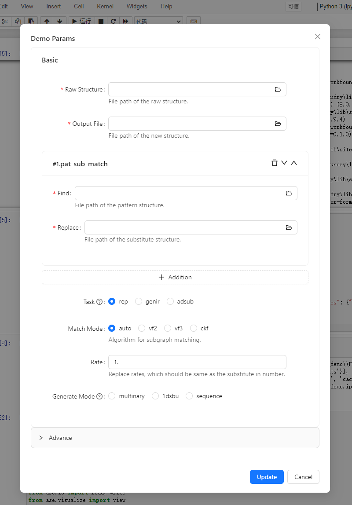

# jupyter-formily

Use [formily](https://github.com/alibaba/formily) in Jupyter.



## Installation

```bash
pip install jupyter-formily
```

## Usage

```python
from jupyter_formily import Formily

example = Formily(schema, options, default_value)
example.display()
```

`schema` can be constructed with [Formily Designer](https://designable-antd.formilyjs.org/) or crafted manually. 
`options` allows you to tune the form to fit you need.
`default_value` allows you to set initial value which follow schema.

`options` is dict, and key as follow:

| key          | Type                                                                                                                    | Default value |
| ------------ | ----------------------------------------------------------------------------------------------------------------------- | ------------- |
| show_modal   | bool                                                                                                                    | True          |
| ok_label     | string                                                                                                                  | "OK"      |
| cancel_label | string                                                                                                                  | "Cancel"      |
| ok_props     | [ISubmitProps](https://ant-design.antgroup.com/components/button#api)                                                   | {}            |
| cancel_props | [ButtonProps](https://ant-design.antgroup.com/components/button#api)                                                    | {}            |
| form_props   | [IFormLayoutProps](https://github.com/alibaba/formily/blob/formily_next/packages/antd/src/form-layout/index.tsx#L6-L38) | {}            |
| modal_props  | [ModalProps](https://ant-design.antgroup.com/components/modal#api)                                                      | {}            |

Check `demo.ipynb` for more information.


## Custom Components
Currently custom can not be used via Formily Designer, you have to add them manually.
A trick to use custom components is to add a similar component in desinger as placeholder.
And then replace it to the component you want by patching the generated schema.

### File Picker
Select file path interactively.

```json
{
  "type": "string",
  "name": "input_file",
  "title": "Input File",
  "x-decorator": "FormItem",
  "x-component": "FilePicker",
  "x-validator": [],
  "x-component-props": {
    "init_path": "./"
  },
  "x-decorator-props": {},
  "x-designable-id": "8j01zeibhn3",
  "x-index": 1
}
```

## Development

### Setup

You need to install dependencies both python and javascript. Please make sure you have installed [poetry](https://github.com/python-poetry/poetry) and [yarn](https://github.com/yarnpkg/yarn).

```shell
# python
poetry install

# javascript
cd vendor/formily && yarn
```

### Start Server

```shell
cd vendor/formily && npm run dev Formily
```
Then you can check widget in `demo.ipynb`.

### Build

```shell
./build.sh
```
